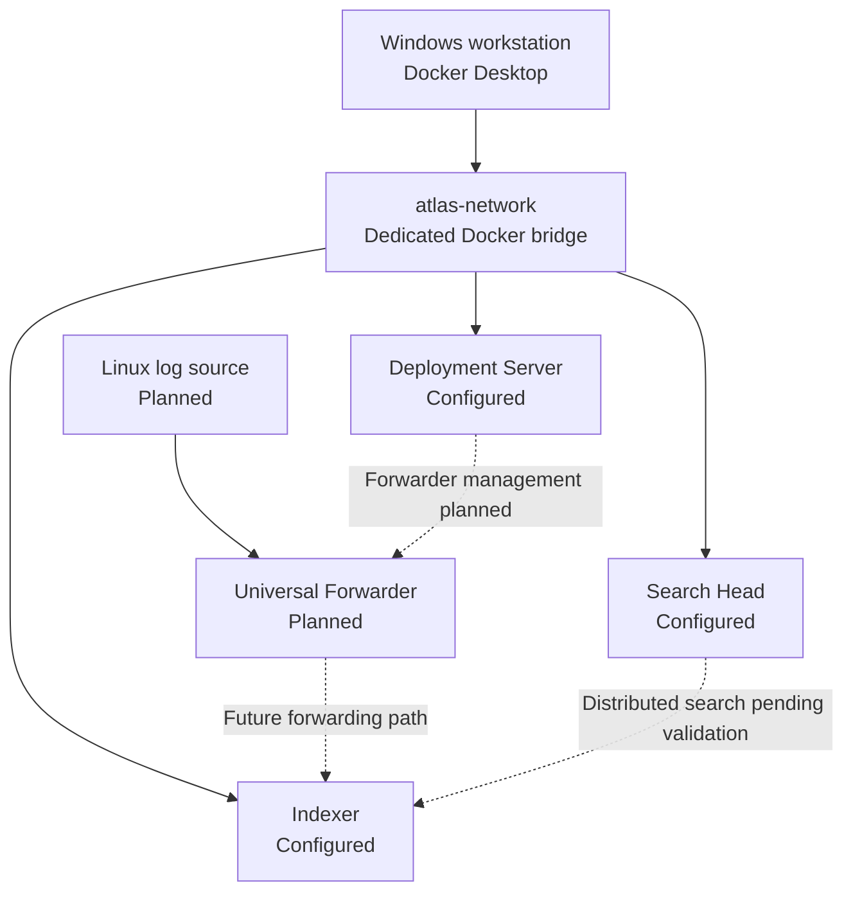

# ResumeOps

> A recruiter-first engineering portfolio featuring Atlas, a containerized Splunk observability lab.

[Live portfolio](https://jannsenagustin.github.io/resumeops/) ·
[Atlas project page](https://jannsenagustin.github.io/resumeops/case-studies/atlas/) ·
[Architecture](docs/architecture.md) ·
[Case study](CASE_STUDY.md) ·
[Infrastructure source](infrastructure/atlas/docker-compose.yml)

## What this repository demonstrates

ResumeOps is the presentation layer for Jannsen Agustin’s engineering work. Its
flagship project, **Atlas**, models separate Splunk Search Head, Indexer, and
Deployment Server responsibilities with Docker Compose on one workstation.

Atlas currently demonstrates:

- a typed three-service Compose configuration for separate Splunk roles;
- a dedicated private bridge network with localhost-only Web mappings;
- role-specific persistent storage for Splunk configuration and runtime data;
- explicit environment-variable and secret-handling boundaries;
- documented trade-offs, including the deliberate deferral of clustering.

**Current status:** architecture and Compose configuration are complete.
Runtime deployment, Splunk role readiness, distributed search, data ingestion,
dashboards, detections, and alerts have not yet been validated or implemented.

## Architecture



The initial topology makes role boundaries visible without claiming production
resilience. All services share one physical host. See
[the architecture document](docs/architecture.md) for component
responsibilities, networking, persistence, security boundaries, and validation
status.

## Technology stack

| Area | Technologies |
| --- | --- |
| Observability | Splunk Enterprise, SPL |
| Infrastructure | Docker Desktop, Docker Compose, Linux |
| Portfolio | Next.js, React, TypeScript, Tailwind CSS |
| Delivery | Git, GitHub Actions, GitHub Pages |

## Engineering contribution

Jannsen designed the initial Atlas topology, scoped the workstation constraints,
defined the Compose services, network, and volumes, documented consequential
architecture decisions, and established an evidence-driven validation sequence.
ResumeOps presents that work alongside approximately seven years of verified
Splunk administration and development experience delivered through Accenture.

## Evidence

The strongest evidence currently available is the repository itself:

- [`docker-compose.yml`](infrastructure/atlas/docker-compose.yml) defines the
  three Splunk roles, network, localhost bindings, and persistent volumes.
- [`.env.example`](infrastructure/atlas/.env.example) documents required local
  inputs without committing credentials.
- [`docs/architecture.md`](docs/architecture.md) records the system boundary and
  the status of every planned connection.
- [`screenshots/docker-workstation-validation.png`](screenshots/docker-workstation-validation.png)
  confirms Docker Desktop, WSL 2, and Docker Compose availability. It does **not**
  prove that the Splunk environment is running.

Runtime evidence will be added only after each check succeeds.

## Run the portfolio

Requirements: Node.js 20 or another version supported by the locked dependencies.

```bash
npm ci
npm run dev
```

Validate the static site:

```bash
npm run lint
npm run typecheck
npm run build
```

The production build exports the homepage and Atlas route to `out/` with the
GitHub Pages base path configured in `next.config.ts`.

## Inspect the Atlas configuration

From `infrastructure/atlas`, copy `.env.example` to `.env`, select a supported
Splunk image tag, set a strong local password, and review the applicable license
terms before setting the required acceptance arguments.

```powershell
Copy-Item .env.example .env
docker compose config
```

The local `.env` file is ignored. Do not commit resolved secrets or license
material. Startup instructions and destructive-reset warnings are in the
[infrastructure README](infrastructure/atlas/README.md).

## Current limitations

- The Compose configuration has not completed runtime validation.
- No Splunk container health or role-readiness result is claimed.
- Distributed search and forwarder management are not configured as validated.
- Linux ingestion, indexed events, dashboards, detections, and alerts are planned.
- Atlas is a single-workstation learning lab, not a production deployment.

## Next milestone

Complete runtime deployment validation: render the resolved Compose
configuration, start the three Splunk services, verify container health and Web
access, confirm service-name resolution and persistent volumes, and capture
sanitized evidence. See [milestones](docs/milestones.md) for the compact status
record and [the case study](CASE_STUDY.md) for the complete engineering story.

## License

This repository is available under the [MIT License](LICENSE).
