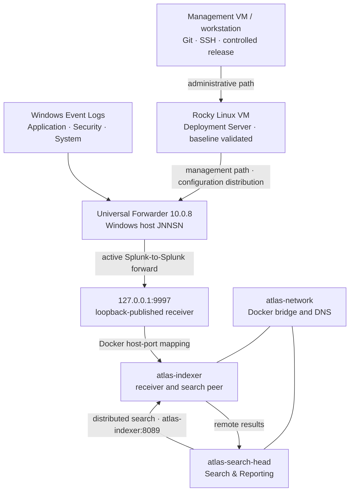

# Atlas Architecture

## System boundary

Atlas models distinct data and management paths on workstation-scale
infrastructure. The Search Head and Indexer run as Docker services; Splunk
Universal Forwarder 10.0.8 runs on Windows. The approved M05 management path
uses a dedicated Rocky Linux Hyper-V VM as the Deployment Server. The
[milestone record](milestones.md) owns validation status.

## Component responsibilities

| Component | Responsibility | Status |
| --- | --- | --- |
| Windows workstation `JNNSN` | Hosts Docker Desktop and the external Universal Forwarder | Operational; Milestone 04 validated |
| Universal Forwarder | Collects Windows Event Logs and the controlled ATL-005 file input; forwarding configuration is centrally managed | Operational; version 10.0.8; ATL-005 validated |
| Search Head | Search interface and distributed-search coordinator | Operational; Milestones 02–04 validated |
| Indexer | Receives, indexes, stores, and searches Windows telemetry | Operational; Milestones 01, 03, and 04 validated |
| Deployment Server | Dedicated Rocky Linux VM distributing independently managed input and output applications | Operational; enrollment and production-style distribution validated through ATL-005 |

The Compose source retains an earlier `atlas-deployment-server` definition.
That stanza is legacy source configuration, not the approved M05 architecture
and not evidence of a deployed service.

## Validated distributed-search flow

The Search Head registers `https://atlas-indexer:8089` as its search peer.
Docker DNS resolves the stable `atlas-indexer` service hostname on
`atlas-network`; a changeable `172.x.x.x` container address is not hardcoded.
TCP 8089 is Splunk's management communication path inside the Docker network,
not a published host Web port.

The configured peer was `Up`, `Healthy`, and `Enabled`, with no health-check
failures. A metadata search launched from the Search Head returned both Atlas
hosts. Job Inspector then showed `dispatch.stream.remote.atlas-indexer`, which
is the decisive point-in-time evidence that the Indexer participated remotely
in execution coordinated by the Search Head.

## Validated ingestion flow

The Universal Forwarder is a Windows service, not a Docker container. It cannot
use Docker's internal service name, so it forwards to `127.0.0.1:9997` on the
host. Docker publishes that loopback endpoint to port 9997 on `atlas-indexer`,
where the existing Splunk receiver accepts the forwarding session.

Compose `expose` describes container-network visibility and does not create a
Windows listener. The `ports` mapping creates the required host-to-container
boundary. Binding it to `127.0.0.1` keeps the receiver off the LAN;
`0.0.0.0:9997` is deliberately not used. Milestone 04 made the existing
receiver reachable from Windows and does not claim to have created it.

ATL-005 adds a separately validated centrally managed path. The Deployment
Server distributes `TA-atlas-demo-inputs` and `TA-atlas-outputs`; the input
monitors `E:\04_PROJECTS\ResumeOps\Atlas\logs\atlas-demo2.log`, and the output
targets `10.0.0.84:9997`. Client-side effective configuration, active
forwarding, indexing, and search were validated. The session record identifies
the receiving role as the Indexer; it does not document a topology change or
replacement of the earlier Milestone 04 loopback path.

## Host-facing access versus internal communication

| Purpose | Address | Boundary |
| --- | --- | --- |
| Search Head Splunk Web | `localhost:8000` | Host-facing, loopback only |
| Indexer Splunk Web | `localhost:8001` | Host-facing, loopback only |
| Windows telemetry ingestion | `127.0.0.1:9997` → `atlas-indexer:9997` | Host-to-container, loopback only |
| Distributed-search management | `https://atlas-indexer:8089` | Container-to-container on `atlas-network` |

Port 8089 is not claimed as publicly published to the host. Remote
administrative authentication was used to establish the peer relationship;
credentials are intentionally excluded from repository documentation.

The Universal Forwarder uses the Windows Virtual Account selected at install,
with installer-granted privileges retained for the chosen Event Log inputs. A
lab-specific `allowRemoteLogin = always` adjustment enabled administrative CLI
validation; it is not presented as a universal production recommendation.
Generated secret-bearing configuration is excluded.

## Persistence

The operational roles each own `etc` and `var` named volumes. These preserve
instance-specific Splunk configuration and runtime data independently of the
disposable container layer. Instance overrides belong in `system/local`, not
`system/default`.

## Management and administrative paths

Deployment Server traffic manages the Universal Forwarder and does not carry
ingested event data. ATL-005 validated application distribution from
`/opt/splunk/etc/deployment-apps/`, effective client configuration, and the
resulting data path. A controlled Git release workflow remains ATL-006 scope.

## Constraints and deferred capabilities

The lab has one Search Head, one Indexer, one workstation, and one failure
domain. It does not demonstrate Indexer clustering, Search Head clustering,
replication, a cluster manager, a deployer, production high availability, or
enterprise production readiness. Git-controlled release, automation,
additional data sources, performance telemetry,
dashboards, alerts and detections, custom TLS/PKI, Azure DevOps CI/CD, and
Kubernetes/Splunk Operator work remain future.

## Validation status

Milestone 01 validated the Indexer. Milestone 02 validated the Search Head.
Milestone 03 validated their distributed-search relationship. Milestone 04
validated the Windows service, TCP reachability, an active Splunk forwarding
session, searchable Application/Security/System data, and remote execution on
`atlas-indexer`. Milestone 05 now validates centralized input and output
distribution plus searchable ingestion from the controlled `atlas:demo` log.
Captured event counts are point-in-time observations, not fixed dataset sizes.
