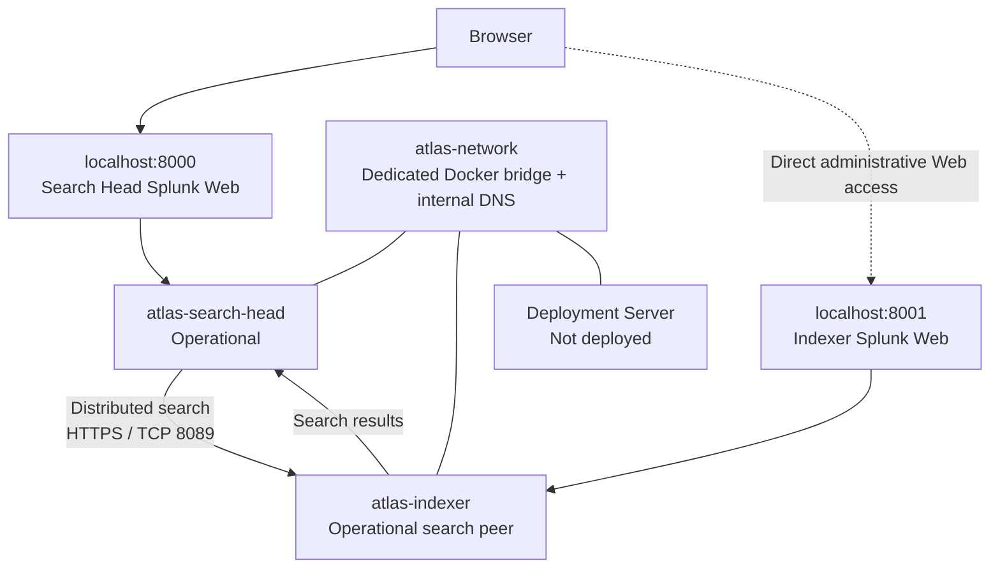

# Atlas Architecture

## System boundary

Atlas models separate Splunk responsibilities on one Windows workstation using
Docker Desktop and Docker Compose. It is a learning lab, not a production
deployment. Milestones 01 through 03 validate an operational Indexer, an
operational Search Head, and distributed search between them. The Deployment
Server and ingestion pipeline remain planned.

## Component responsibilities

| Component | Responsibility | Status |
| --- | --- | --- |
| Windows workstation | Hosts Docker Desktop and all lab resources | Docker availability evidenced |
| Search Head | Search interface and distributed-search coordinator | Operational; Milestones 02 and 03 validated |
| Indexer | Stores Splunk data and executes remote search work | Operational; Milestones 01 and 03 validated |
| Deployment Server | Planned forwarder configuration management | Configured in Compose; not deployed |
| Linux source | Planned authentication-event source | Planned |
| Universal Forwarder | Planned data forwarding to the Indexer | Planned |

## Validated distributed-search flow

The Search Head registers `https://atlas-indexer:8089` as its search peer.
Docker DNS resolves the stable `atlas-indexer` service hostname on
`atlas-network`; a changeable `172.x.x.x` container address is not hardcoded.
TCP 8089 is Splunk's management communication path inside the Docker network,
not a published host Web port.

The configured peer was `Up`, `Healthy`, and `Enabled`, with no health-check
failures. A metadata search launched from the Search Head returned both Atlas
hosts. Job Inspector then showed `dispatch.stream.remote.atlas-indexer`, which
is the decisive point-in-time evidence that the Indexer participated remotely
in execution coordinated by the Search Head.

## Host-facing access versus internal communication

| Purpose | Address | Boundary |
| --- | --- | --- |
| Search Head Splunk Web | `localhost:8000` | Host-facing, loopback only |
| Indexer Splunk Web | `localhost:8001` | Host-facing, loopback only |
| Distributed-search management | `https://atlas-indexer:8089` | Container-to-container on `atlas-network` |

Port 8089 is not claimed as publicly published to the host. Remote
administrative authentication was used to establish the peer relationship;
credentials are intentionally excluded from repository documentation.

## Persistence

The operational roles each own `etc` and `var` named volumes. These preserve
instance-specific Splunk configuration and runtime data independently of the
disposable container layer. Instance overrides belong in `system/local`, not
`system/default`.

## Constraints and deferred capabilities

The lab has one Search Head, one Indexer, one workstation, and one failure
domain. It does not demonstrate Indexer clustering, Search Head clustering,
replication, a cluster manager, a deployer, a Deployment Server, production
high availability, or enterprise production readiness. Ingestion, dashboards,
detections, alerts, TLS hardening, and production secret management remain
future work.

## Validation status

Milestone 01 validated the Indexer. Milestone 02 validated the Search Head.
Milestone 03 validated their distributed-search relationship through peer
health, functional SPL results, and Job Inspector evidence of remote Indexer
execution. No later Atlas capability is marked complete.
