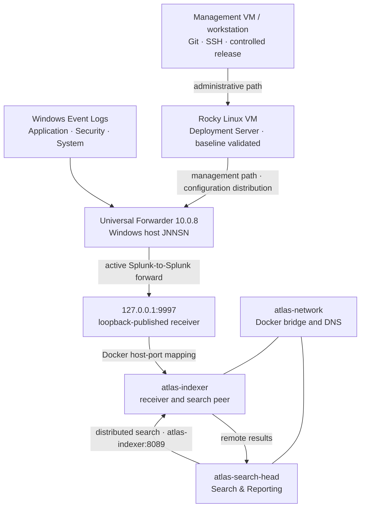

# Atlas Architecture

## System boundary

Atlas models distinct data and management paths on workstation-scale
infrastructure. The Search Head and Indexer run as Docker services; Splunk
Universal Forwarder 10.0.8 runs on Windows. The approved M05 management path
uses a dedicated Rocky Linux Hyper-V VM as the Deployment Server. The
[milestone record](milestones.md) owns validation status.

## Component responsibilities

| Component | Responsibility | Status |
| --- | --- | --- |
| Windows workstation `JNNSN` | Hosts Docker Desktop and the external Universal Forwarder | Operational; Milestone 04 validated |
| Universal Forwarder | Collects Windows Event Logs and the controlled ATL-005 file input; forwarding configuration is centrally managed | Operational; version 10.0.8; ATL-005 validated |
| Search Head | Search interface and distributed-search coordinator | Operational; Milestones 02–04 validated |
| Indexer | Receives, indexes, stores, and searches Windows telemetry | Operational; Milestones 01, 03, and 04 validated |
| Deployment Server | Dedicated Rocky Linux VM distributing independently managed input and output applications | Operational; enrollment and production-style distribution validated through ATL-005 |

The Compose source retains an earlier `atlas-deployment-server` definition.
That stanza is legacy source configuration, not the approved M05 architecture
and not evidence of a deployed service.

## Validated distributed-search flow

The Search Head registers `https://atlas-indexer:8089` as its search peer.
Docker DNS resolves the stable `atlas-indexer` service hostname on
`atlas-network`; a changeable `172.x.x.x` container address is not hardcoded.
TCP 8089 is Splunk's management communication path inside the Docker network,
not a published host Web port.

The configured peer was `Up`, `Healthy`, and `Enabled`, with no health-check
failures. A metadata search launched from the Search Head returned both Atlas
hosts. Job Inspector then showed `dispatch.stream.remote.atlas-indexer`, which
is the decisive point-in-time evidence that the Indexer participated remotely
in execution coordinated by the Search Head.

## Validated ingestion flow

The Universal Forwarder is a Windows service, not a Docker container. It cannot
use Docker's internal service name, so it forwards to `127.0.0.1:9997` on the
host. Docker publishes that loopback endpoint to port 9997 on `atlas-indexer`,
where the existing Splunk receiver accepts the forwarding session.

Compose `expose` describes container-network visibility and does not create a
Windows listener. The `ports` mapping creates the required host-to-container
boundary. Binding it to `127.0.0.1` keeps the receiver off the LAN;
`0.0.0.0:9997` is deliberately not used. Milestone 04 made the existing
receiver reachable from Windows and does not claim to have created it.

ATL-005 adds a separately validated centrally managed path. The Deployment
Server distributes `TA-atlas-demo-inputs` and `TA-atlas-outputs`; the input
monitors `E:\04_PROJECTS\ResumeOps\Atlas\logs\atlas-demo2.log`, and the output
targets `10.0.0.84:9997`. Client-side effective configuration, active
forwarding, indexing, and search were validated. The session record identifies
the receiving role as the Indexer; it does not document a topology change or
replacement of the earlier Milestone 04 loopback path.

## Host-facing access versus internal communication

| Purpose | Address | Boundary |
| --- | --- | --- |
| Search Head Splunk Web | `localhost:8000` | Host-facing, loopback only |
| Indexer Splunk Web | `localhost:8001` | Host-facing, loopback only |
| Windows telemetry ingestion | `127.0.0.1:9997` → `atlas-indexer:9997` | Host-to-container, loopback only |
| Distributed-search management | `https://atlas-indexer:8089` | Container-to-container on `atlas-network` |

Port 8089 is not claimed as publicly published to the host. Remote
administrative authentication was used to establish the peer relationship;
credentials are intentionally excluded from repository documentation.

The Universal Forwarder uses the Windows Virtual Account selected at install,
with installer-granted privileges retained for the chosen Event Log inputs. A
lab-specific `allowRemoteLogin = always` adjustment enabled administrative CLI
validation; it is not presented as a universal production recommendation.
Generated secret-bearing configuration is excluded.

## Persistence

The operational roles each own `etc` and `var` named volumes. These preserve
instance-specific Splunk configuration and runtime data independently of the
disposable container layer. Instance overrides belong in `system/local`, not
`system/default`.

## Management and administrative paths

Deployment Server traffic manages the Universal Forwarder and does not carry
ingested event data. ATL-005 validated application distribution from
`/opt/splunk/etc/deployment-apps/`, effective client configuration, and the
resulting data path. ATL-006 validated the reviewed manual Git-controlled
release workflow. Rollback was verified as available but remained unexercised;
ATL-007 deployment automation remains inactive.

## Atlas website application architecture

Console, Atlas, and Planning use one `atlas-app-shell` layout with one shared
`AtlasSidebar` implementation. Page-local navigation remains inside each
surface's content column, so it does not create a competing application shell.

Repository planning records remain authoritative for engineering state.
`lib/atlasProjectState.ts` is the website's single canonical derived projection
for milestone state, validation, active batch, active ATL work, current work,
project completion, and evidence metadata. UI surfaces consume that projection
instead of maintaining page-specific copies. `lib/atlasStatus.ts` owns the
semantic status-to-tone mapping, including the validated green treatment used
by plain `Validated` states.

This website architecture does not change the Milestone 05 engineering result.
Milestone 05 remains Complete / Validated; BATCH-007 tracked later website
maintenance separately.

## Validated Search Head management and KV TLS

ATL-042 and BATCH-009 replaced only the Search Head's default splunkd
management/KV certificate path with the standards-valid trust model approved in
EP-005. The Search Head-local `[sslConfig]` enables splunkd TLS, keeps client
certificates optional, and references one restricted Search Head server bundle
and the public Atlas root. The Indexer, forwarding, Deployment Server, Splunk
Web certificate, host-port, and MCP boundaries did not change.

The dedicated Atlas root is self-issued with critical `CA:TRUE, pathlen:0` and
critical certificate-signing and CRL-signing usage. Its SHA-256 fingerprint is
`02:DC:7A:72:D6:6A:E3:84:E5:E5:E6:E8:13:D6:41:E2:C5:FB:EC:91:C6:38:6B:57:AF:5D:05:98:58:9F:9D:A0`.
Its subject and issuer are `CN=Atlas-Internal-Root-CA, O=Project-Atlas`, its
serial is `3F407E63DE5B616DAECC8419B8A76D4C5C55C96F`, and its validity is
2026-09-02 through 2036-08-30.
Its encrypted private key remains under human control outside Git, Docker,
Splunk, evidence, and backup storage.

The shared Search Head leaf has `subjectAltName = DNS:atlas-search-head`,
critical `basicConstraints = CA:FALSE`, critical digital-signature and
key-encipherment usage, and
`extendedKeyUsage = critical, serverAuth, clientAuth`. Its serial is
`6657C3D4D746B79CAE8AF9E77CFC88D1`, and its SHA-256 fingerprint is
`FF:9E:A7:A1:48:88:F1:27:45:CD:0B:9E:6F:08:E0:B8:78:F4:77:3C:35:EF:2A:E3:FA:6E:D8:EA:35:69:B8:3D`.
Its validity is 2026-09-02 through 2028-12-05. The effective Search Head-local
paths are `/opt/splunk/etc/auth/atlas/atlas-search-head-server.pem` for
`serverCert` and `/opt/splunk/etc/auth/atlas/atlas-root-ca.pem` for
`sslRootCAPath`; `[kvstoreSslClientConfig]` remains absent.
Both internal TCP 8089 and KV Store TCP 8191 present this Atlas chain.

Normal OpenSSL hostname verification and Python's default `SSLContext` validate
the chain for `atlas-search-head`. The pinned Splunk SDK reaches the HTTP
authentication boundary through that same verified context. Tests with the old
CA, an unrelated CA, a wrong hostname, missing trust, and an out-of-validity
verification time fail closed. TCP 8089 remains internal to `atlas-network`,
Search Head and Indexer health remain intact, and distributed-search peer health
and bounded remote execution remain validated.

Splunk 10.0.8 separately owns `[dataplaneSslConfig]` for HTTP servers inside
helper processes. Its `server_dp.pem` is issued by the automatically generated
`dp_ca.pem`, with `dp_ca.srl` maintaining issuance serial state. This data-plane
chain is expected runtime state, does not participate in the splunkd
management/KV chain, and is not an additional Atlas trust owner.

The authoritative pre-change Search Head `etc` checkpoint is
`E:\Projects\atlas-backups\2026-09-02-batch-009-search-head-etc-cold-20260902-153720\atlas-search-head-etc.tar.gz`
with SHA-256
`BB070E518638C8FBF17356D2AA282D2682A8B815BFE7689BBA2E7BD4C69B81E3`.
Rollback remains available but was not exercised.

## Constraints and deferred capabilities

The lab has one Search Head, one Indexer, one workstation, and one failure
domain. It does not demonstrate Indexer clustering, Search Head clustering,
replication, a cluster manager, a deployer, production high availability, or
enterprise production readiness. Deployment automation,
additional data sources, performance telemetry,
dashboards, alerts and detections, broader TLS/PKI expansion, Azure DevOps CI/CD, and
Kubernetes/Splunk Operator work remain future.

## Validation status

Milestone 01 validated the Indexer. Milestone 02 validated the Search Head.
Milestone 03 validated their distributed-search relationship. Milestone 04
validated the Windows service, TCP reachability, an active Splunk forwarding
session, searchable Application/Security/System data, and remote execution on
`atlas-indexer`. Milestone 05 now validates centralized input and output
distribution plus searchable ingestion from the controlled `atlas:demo` log.
Captured event counts are point-in-time observations, not fixed dataset sizes.
