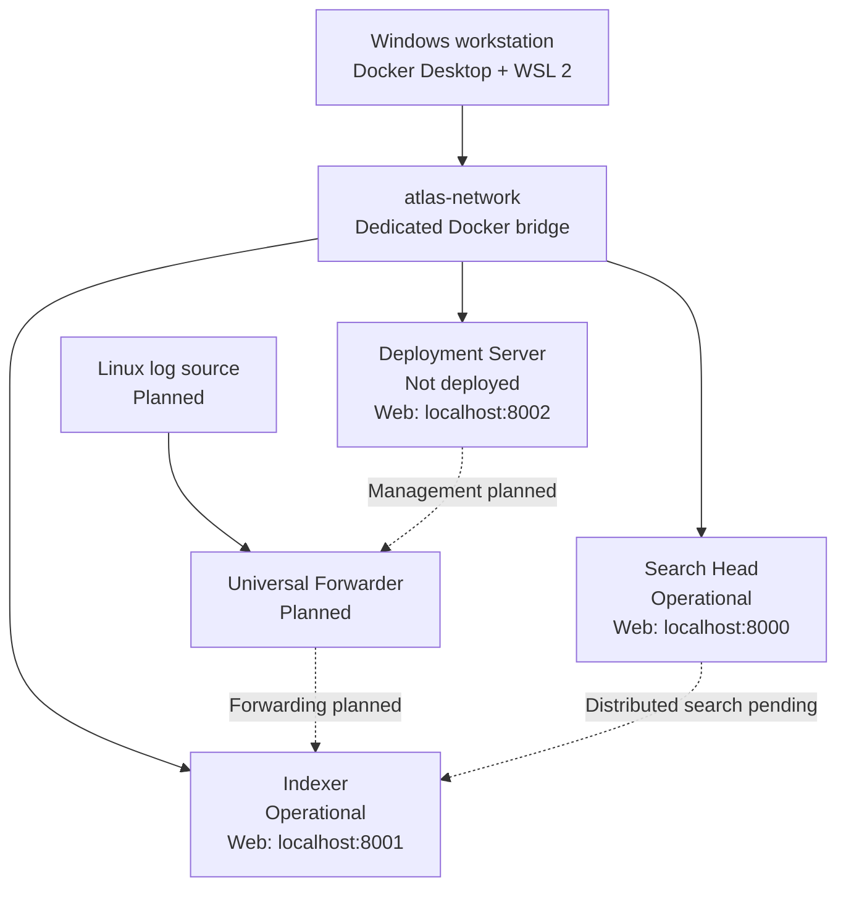

# Atlas Architecture

## System boundary

Atlas models separate Splunk responsibilities on one Windows workstation using
Docker Desktop and Docker Compose. It is a learning lab, not a production
deployment. The target architecture and Compose configuration are complete.
The Indexer and Search Head have completed independent runtime deployment
validation; distributed search is not configured.

## Component responsibilities

| Component | Responsibility | Status |
| --- | --- | --- |
| Windows workstation | Hosts Docker Desktop and all lab resources | Docker availability evidenced |
| Search Head | Search interface and future distributed-search client | Operational; Milestone 02 validated |
| Indexer | Future receiving, indexing, and search-peer role | Operational; Milestone 01 validated |
| Deployment Server | Planned forwarder configuration management | Configured; not deployed |
| Linux source | Generates authentication events | Planned |
| Universal Forwarder | Sends selected Linux events to the Indexer | Planned |

## Data and control flow

The present runtime includes the Search Head and Indexer as independently
operational services. Their distributed-search management relationship is
intended to use internal Docker DNS and port `8089`, but it has not been
configured or validated.

The future data path is Linux authentication logs → Universal Forwarder →
Indexer → searchable results on the Search Head. Deployment Server management
of the Universal Forwarder is also planned. No event, index, dashboard, alert,
or detection is claimed to exist.

## Networking

The operational Search Head and Indexer join the dedicated `atlas-network`
bridge with separate private Docker addresses. Docker service names are intended
to provide internal resolution. Splunk management communication stays inside
this network.

Only Splunk Web interfaces are published to the host, with explicit
`127.0.0.1` bindings. The proposed host ports are 8000 for the Search Head, 8001
for the Indexer, and 8002 for the Deployment Server. The receiving port is not
published and receiving is not yet enabled.

## Persistence

Each role owns two named volumes: `atlas-<role>-etc` for Splunk configuration
and `atlas-<role>-var` for runtime data. Milestones 01 and 02 validated this
role-specific persistence for the operational Indexer and Search Head.

`docker compose down` preserves the volumes. `docker compose down --volumes`
is intentionally documented as destructive.

## Secrets and licensing

The repository commits `.env.example`, never the resolved `.env`. Password,
image tag, license acceptance, and general-terms inputs must be resolved
locally. Compose uses required-variable expressions so absent inputs stop
configuration rendering.

Screenshots and logs must be reviewed for credentials, license material,
tokens, addresses, or resolved environment values before being committed.

## Constraints and deferred clustering

All services share one workstation, so the lab has a single CPU, storage,
network, and failure domain. Search Head and Indexer clustering are deferred
until the basic topology and data path are operationally validated. Adding
cluster roles now would increase resource demand and failure modes without
providing genuine host-level high availability.

TLS hardening, replication, high availability, production secret management,
performance testing, and production security controls remain out of scope.

## Validation status

Static source review confirms that the intended services, network, ports, and
volumes are represented. Milestone 01 validated the Indexer; Milestone 02
validated the Search Head, continued Indexer health, localhost Web access,
administrator login, shared bridge-network membership, and independent
persistent storage. The distributed-search relationship remains unconfigured.
Deployment Server and ingestion services are not deployed or validated.
