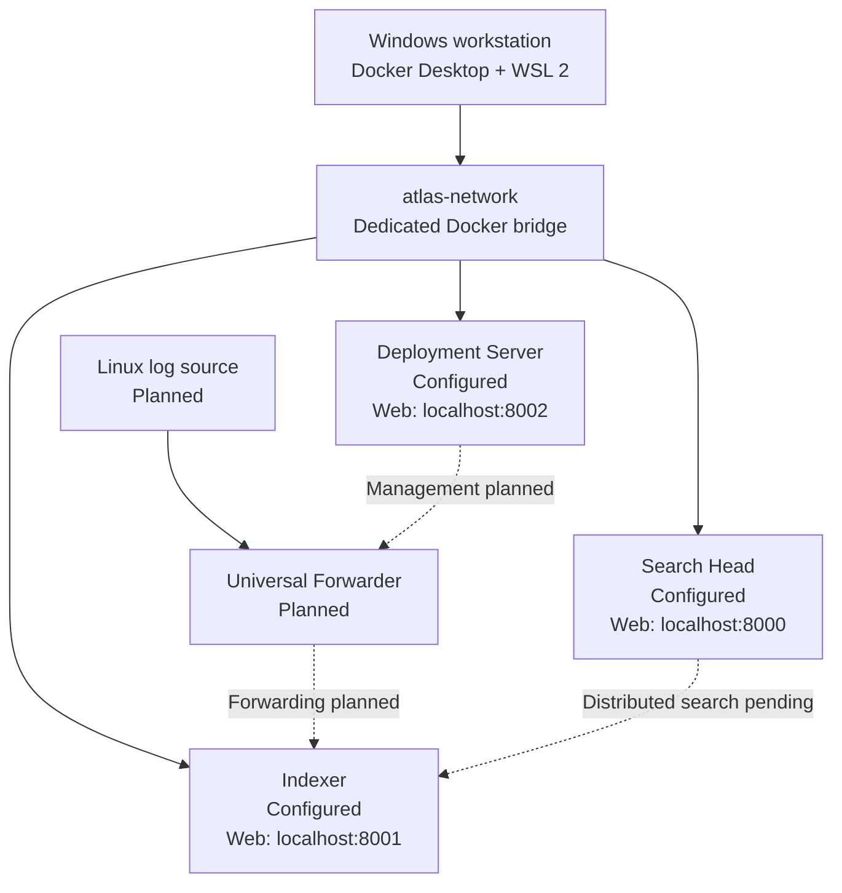

# Atlas Architecture

## System boundary

Atlas models separate Splunk responsibilities on one Windows workstation using
Docker Desktop and Docker Compose. It is a learning lab, not a production
deployment. The architecture and Compose configuration are complete; runtime
behavior remains awaiting validation.

## Component responsibilities

| Component | Responsibility | Status |
| --- | --- | --- |
| Windows workstation | Hosts Docker Desktop and all lab resources | Docker availability evidenced |
| Search Head | Planned search interface and distributed-search client | Configured; runtime validation pending |
| Indexer | Planned receiving, indexing, and search peer | Configured; runtime validation pending |
| Deployment Server | Planned forwarder configuration management | Configured; runtime validation pending |
| Linux source | Generates authentication events | Planned |
| Universal Forwarder | Sends selected Linux events to the Indexer | Planned |

## Data and control flow

The present Compose definition establishes only the three Splunk services. The
Search Head-to-Indexer management relationship is intended to use internal
Docker DNS and port `8089`, but it has not been configured or validated.

The future data path is Linux authentication logs → Universal Forwarder →
Indexer → searchable results on the Search Head. Deployment Server management
of the Universal Forwarder is also planned. No event, index, dashboard, alert,
or detection is claimed to exist.

## Networking

All services join the dedicated `atlas-network` bridge. Docker service names are
intended to provide internal resolution. Splunk management communication stays
inside this network.

Only Splunk Web interfaces are published to the host, with explicit
`127.0.0.1` bindings. The proposed host ports are 8000 for the Search Head, 8001
for the Indexer, and 8002 for the Deployment Server. The receiving port is not
published and receiving is not yet enabled.

## Persistence

Each role owns two named volumes: `atlas-<role>-etc` for Splunk configuration
and `atlas-<role>-var` for runtime data. This separates role state and allows
normal container recreation without discarding data.

`docker compose down` preserves the volumes. `docker compose down --volumes`
is intentionally documented as destructive.

## Secrets and licensing

The repository commits `.env.example`, never the resolved `.env`. Password,
image tag, license acceptance, and general-terms inputs must be resolved
locally. Compose uses required-variable expressions so absent inputs stop
configuration rendering.

Screenshots and logs must be reviewed for credentials, license material,
tokens, addresses, or resolved environment values before being committed.

## Constraints and deferred clustering

All services share one workstation, so the lab has a single CPU, storage,
network, and failure domain. Search Head and Indexer clustering are deferred
until the basic topology and data path are operationally validated. Adding
cluster roles now would increase resource demand and failure modes without
providing genuine host-level high availability.

TLS hardening, replication, high availability, production secret management,
performance testing, and production security controls remain out of scope.

## Validation status

Static source review confirms that the intended services, network, ports, and
volumes are represented. Runtime checks—including image compatibility,
container health, Web access, service DNS, Splunk role readiness, and persistent
state—are pending.
