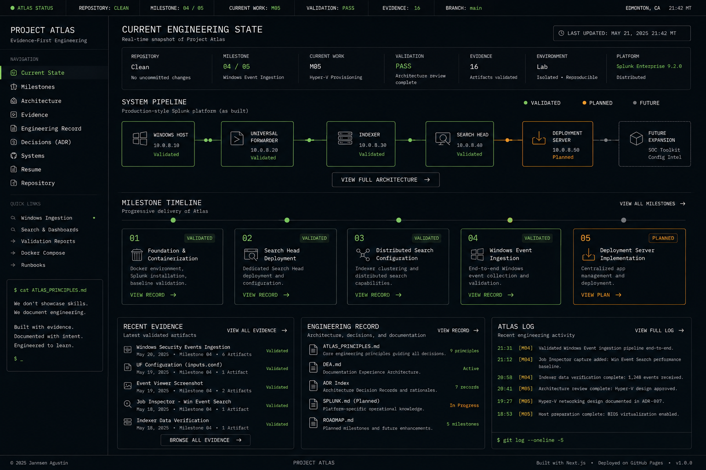

# Atlas Engineering Console

This document set is the canonical visual-direction reference for the approved
Atlas Engineering Console redesign. Atlas should feel like the operational
console of a real engineering system: evidence-first, restrained, deliberate,
and built around the engineering record.

## Reference Set

- [Vision](VISION.md) defines the approved identity and reader experience.
- [Design Principles](design-principles.md) defines permanent visual rules.
- [Component Roadmap](component-roadmap.md) records planned design evolution
  without claiming implementation.
- [Approved visual reference](images/atlas-engineering-console-visual-reference-v1.png)
  provides the shared visual anchor.

## Authority and Boundaries

The [Project Atlas Engineering Manifesto](../../../ATLAS_PRINCIPLES.md) remains
the governing engineering constitution. The
[Documentation Experience Architecture](../../dea/README.md) governs discovery
and reading behavior. The [milestone register](../../milestones.md) and its
linked engineering records remain authoritative for system state and evidence.

This design set interprets those sources visually. It does not modify them,
replace their responsibilities, or authorize application implementation.
Implementation begins only after design approval and must preserve the approved
engineering philosophy, factual status, accessibility, and documentation
architecture.

