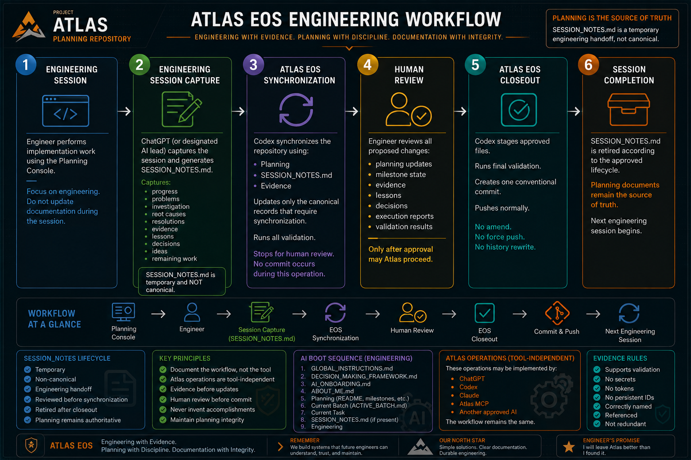

# Atlas Operations

Atlas engineering moves through six operations. The operations describe what
must happen and where human approval belongs; they do not depend on a specific
AI product. Planning remains authoritative throughout the workflow.



This is the official visual representation of Atlas EOS. It covers Engineering
Session, Engineering Session Capture, Atlas EOS Synchronization, Human Review,
Atlas EOS Closeout, and Session Completion. Planning documents remain the
canonical source of truth after synchronization; `SESSION_NOTES.md` is the
authoritative engineering record for the session it captures.

## 1. Engineering Session

The engineer performs the implementation work. Documentation updates should not
interrupt the engineering session.

During the session, ChatGPT or another designated engineering lead AI captures
the work and prepares [SESSION_NOTES.md](SESSION_NOTES.md).

## 2. Engineering Session Capture

Engineering Session Capture produces `SESSION_NOTES.md`, a temporary engineering
handoff. It may capture:

- progress;
- problems;
- investigation;
- root causes;
- resolutions;
- evidence;
- lessons;
- decisions;
- ideas; and
- remaining work.

Session notes are reviewed before synchronization. They authoritatively record
what occurred during that engineering session, but they do not replace human
approval or the canonical owners of ongoing repository state. Their job is to
carry verified engineering context into Atlas EOS.

## 3. Atlas EOS Synchronization

Codex synchronizes the repository using Planning, reviewed session notes, and
evidence. It verifies the handoff against repository state and updates only the
canonical records that require synchronization.

After validation, Codex stops for human review. It does not commit during this
operation.

## 4. Human Review

The engineer reviews the proposed planning updates, milestone state, evidence,
lessons, decisions, execution reports, and validation results. Atlas does not
proceed to closeout until the engineer approves the synchronized result.

## 5. Atlas EOS Closeout

After approval, Codex stages only the approved files and runs final validation.
It then creates one conventional commit and pushes normally.

Closeout never amends a commit, force-pushes, or rewrites history.

## 6. Session Completion

After closeout, retire `SESSION_NOTES.md` according to its approved lifecycle.
Planning documents remain the source of truth for the next engineering session.

## Complete workflow

```text
Planning Console
        ↓
Engineer
        ↓
Engineering Session Capture
        ↓
SESSION_NOTES.md
        ↓
Atlas EOS Synchronization
        ↓
Human Review
        ↓
Atlas EOS Closeout
        ↓
Commit
        ↓
Next Engineering Session
```

## Session notes lifecycle

`SESSION_NOTES.md` is temporary and authoritative for the engineering session
it records. The engineer reviews it before synchronization. Codex reads it
first, never substitutes `SESSION_TEMPLATE.md`, and reconciles its documented
outcomes into Planning and evidence before proposing canonical updates.

After approved closeout, retire the notes by clearing them for the next session
or archiving them when their raw history has lasting value. An archive remains
historical context, not planning authority. Planning always remains
authoritative.
