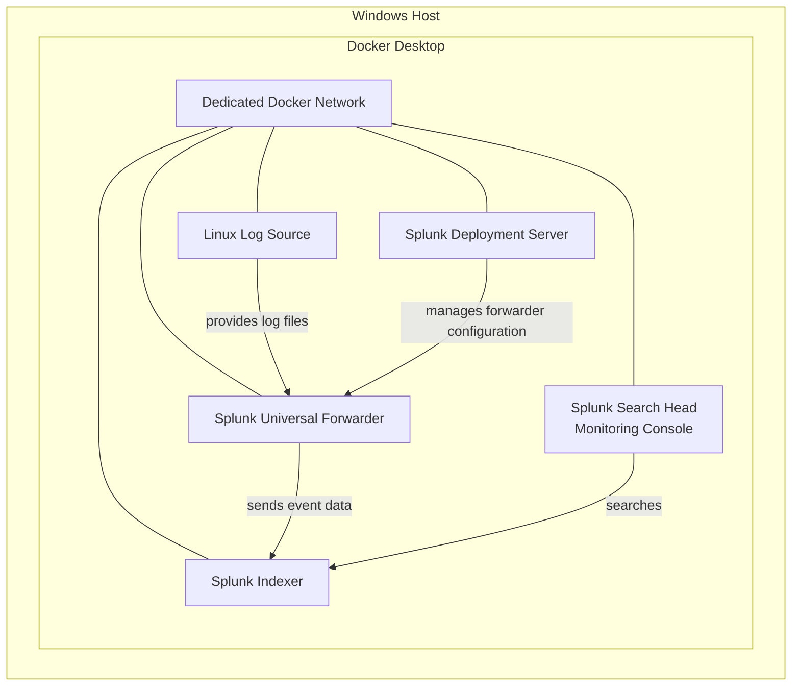

# Enterprise Observability Home Lab Diagram

This diagram represents the planned Sprint 6A architecture. It describes responsibilities and relationships, not a completed deployment.

The Deployment Server relationship is limited to the Universal Forwarder. The diagram does not imply Deployment Server management of the Indexer or Search Head.
